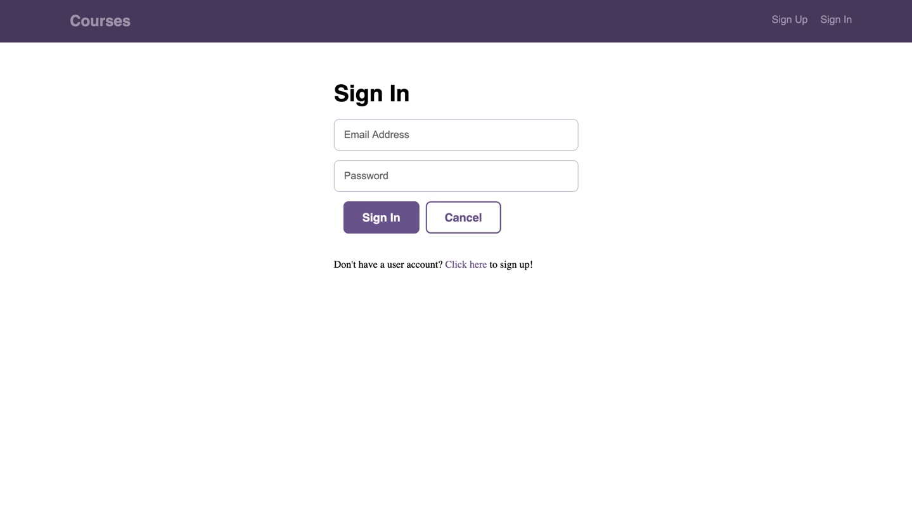

# TechDegree-Final-Project

Getting started

Open a terminal or command window and start the REST API application.

First install the project dependencies with 

npm install

Browse to the api folder and run the command npm start.

npm start
To test the Express server, browse to the URL http://localhost:5000/.

Once you've started the REST API application, you can typically just leave the app running in the background.

Open another terminal or command window and start your React application.

Browse to the client folder and run the command npm start.

The create-react-app development server should start and open your application into your default browser. If the development server started but it didn't open in the browser, try manually browsing to it at http://localhost:3000/.